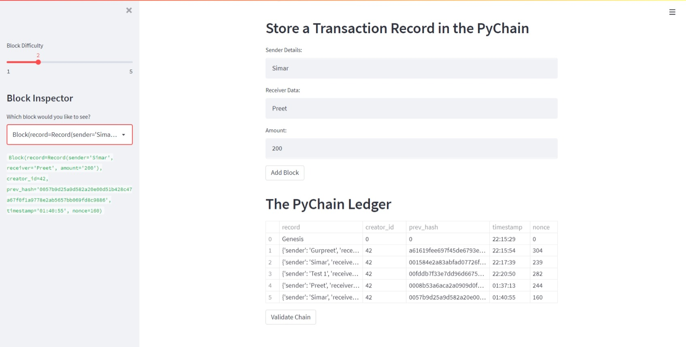
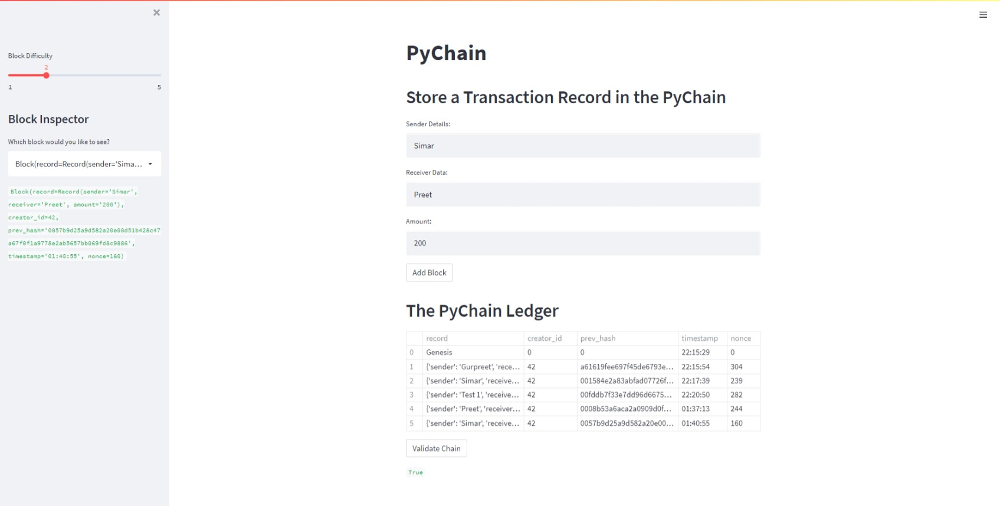

# Columbia_Fintech_Module18
# Project Title
Py Chain

This program shows how to create a block chain. Most of the aspects of blockchain and distributed computing are exhibited in this program. 
The program demonstrates hashing functionality, linking one block with the previous block using the previous block hash key.

## Streamlit
The program also demonstrates Stremlit functionality. Streamlit offers an easy and seamless way to create web interface. The block chain is viewed on a web page using streamlit. 
This program uses basic stremlit functionality of showing text boxes, user input boxes, buttons and sidebars

---

## Technologies

This project is written in python. The required libraries are as follows
streamlit, dataclasses, typing, datetime, pandas, hashlib

---

## Usage

This project demonstrates streamlit functionality and demonstrates various blockchain functionality.

